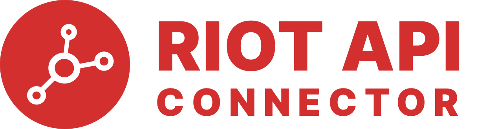

    

    
    

## Introduction

Riot API Connector is an in development tool to help [Laravel](https://laravel.com/) developers and [League of Legends](https://www.leagueoflegends.com/en-us/) 
enjoyers to create applications based on [Riot's API](https://developer.riotgames.com/apis).

## License

Riot API Connector is open-sourced software licensed under the [MIT license](LICENSE).
